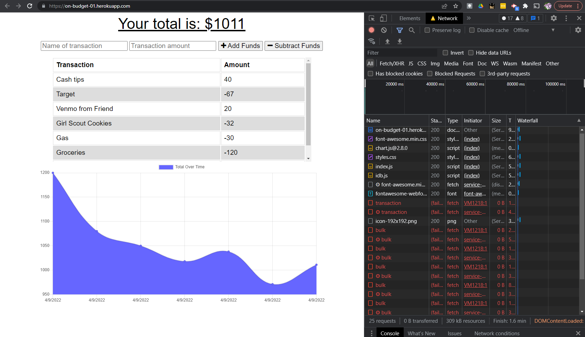
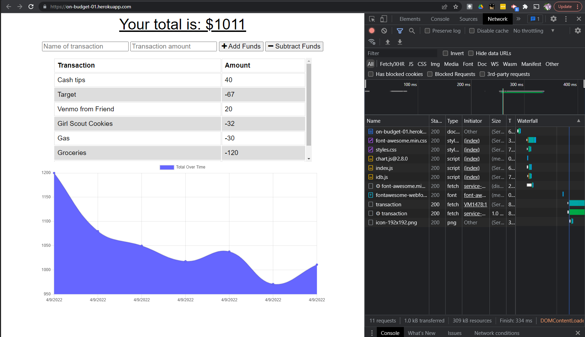

  
  # Budget-Tracker | On Budget
  

  ## Description
  Users can track budget and expenses while on the go!

  ## Preview
  
  

  ## Table of Contents
  * [Installation](#Installation)
  * [Usage](#Usage)
  * [Credits](#Credits)
  * [License](#License)
  * [Contributions](#Contributions)
  * [Test](#Test)
  * [Questions](#Questions)
  

  ## Installation
  Visit [deployed page](https://on-budget-01.herokuapp.com/) and download PWA extension for app experience on mobile devices.

  ## Usage
  On Budget can be used on mobile devices or from a desktop for the same experience! 

  ## Credits
  Starter code from [boot-camp/symmetrical-bassoon](https://github.com/coding-boot-camp/symmetrical-bassoon).

  ## License
  
  
  ### MIT License

  Copyright 2022 Claire Rosenfrisk

  Permission is hereby granted, free of charge, to any person obtaining a copy of this software and associated documentation files (the "Software"), to deal in the Software without restriction, including without limitation the rights to use, copy, modify, merge, publish, distribute, sublicense, and/or sell copies of the Software, and to permit persons to whom the Software is furnished to do so, subject to the following conditions:
      
  The above copyright notice and this permission notice shall be included in all copies or substantial portions of the Software.
      
  THE SOFTWARE IS PROVIDED "AS IS", WITHOUT WARRANTY OF ANY KIND, EXPRESS OR IMPLIED, INCLUDING BUT NOT LIMITED TO THE WARRANTIES OF MERCHANTABILITY, FITNESS FOR A PARTICULAR PURPOSE AND NONINFRINGEMENT. IN NO EVENT SHALL THE AUTHORS OR COPYRIGHT HOLDERS BE LIABLE FOR ANY CLAIM, DAMAGES OR OTHER LIABILITY, WHETHER IN AN ACTION OF CONTRACT, TORT OR OTHERWISE, ARISING FROM, OUT OF OR IN CONNECTION WITH THE SOFTWARE OR THE USE OR OTHER DEALINGS IN THE SOFTWARE.
  

  ## Contributions
  Viewers can contact @crosenfrisk with feedback and suggestions.

  ## Test
  Add data while in airplane mode OR use Chrome Dev tools to toggle Network to Offline -- add input and then reopen app. Data should persist. Next time the user is Online i.e. No Throttling, information should move from bulk storage to IndexedDB.

  
  ## Questions
  If you have any questions about this project, please contact me directly at claire.rosenfrisk@gmail.com. You can view more of my work on 
   [My GitHub Profile](https://github.com/crosenfrisk).

